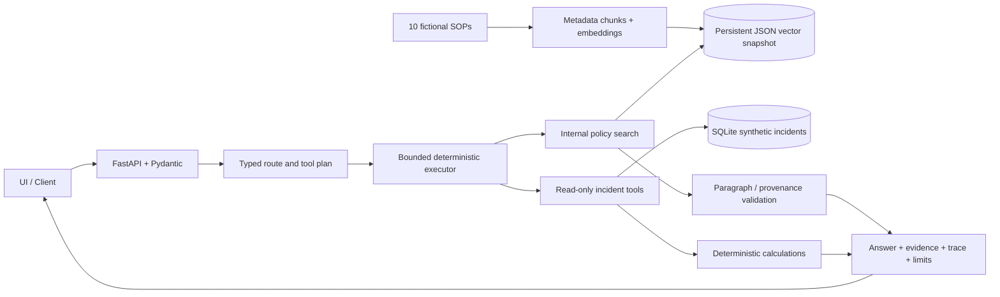

# OpsPilot — Enterprise Operational Intelligence Copilot

[](https://github.com/Nokhin/opspilot/actions/workflows/ci.yml)

An evidence-grounded incident investigation demo combining internal-policy RAG,
SQLite incident history, four typed read-only tools, routing and evaluation.
**HarbourLink Services, all ten policies and all 240 incidents are fictional/synthetic.**
V1 includes the RAG foundation and structured-data tools together; no separate V0 release.

Published [V1 release](https://github.com/Nokhin/opspilot/releases/tag/v1.0-rag-tools-evals)
includes source/evidence archives and checksums. Python 3.11/3.13
[CI workflow](https://github.com/Nokhin/opspilot/actions/workflows/ci.yml) verifies the public history and offline suites;
the [publication receipt](evaluation/release_v1/VALIDATION.json) records actual checks.

## Run locally

Use Python 3.11–3.13 (tested: macOS ARM64 / Python 3.13.7 and 3.13.9;
Linux / Python 3.11.17).
The default **offline extractive baseline** needs no GPU, external API key, model
download or cloud vector database.

```bash
python3.13 -m venv .venv
source .venv/bin/activate
python -m pip install -r requirements-dev.lock
python -m pip install --no-deps -e .
python -m opspilot.cli bootstrap
python -m uvicorn opspilot.api.main:app --host 127.0.0.1 --port 8080
```

Open [the demo](http://127.0.0.1:8080) or [API docs](http://127.0.0.1:8080/docs).
Bootstrap preserves existing stores. An explicit `--reset` replaces only the owned
demo snapshots; stop/restart the API around a rebuild because the index is cached.

```bash
python -m opspilot.cli seed --reset
python -m opspilot.cli ingest --reset
pytest -q
ruff check opspilot tests
ruff format --check opspilot tests
python -m opspilot.cli evaluate --output var/evaluation
```

Ingestion is an operator CLI, with no public upload endpoint. Markdown/TXT require
the metadata/section format in `corpus/policies/`. Limits: 256 KiB per file / 50 files.
PDF/DOCX are deferred.

## Docker / VPS

```bash
docker compose up --build -d --wait
docker compose exec -T opspilot python -m opspilot.cli evaluate --output var/evaluation
docker compose logs -f opspilot
docker compose down
```

One non-root container, one persistent volume, one worker, 1.5 CPU / 2 GiB limits.
The port binds to loopback; use an HTTPS reverse proxy on the VPS. `down` preserves
data. Native ARM64 and emulated AMD64 packaging are validated separately.
See [deployment details](docs/DEPLOYMENT.md) and [acceptance evidence](docs/FINAL_ACCEPTANCE.md).

## Demo journeys

- **Policy:** “A Severity 1 digital-service outage has lasted 35 minutes. According to
  internal policy, who must be notified and within what timeframe?”
- **Data:** “How many payment-service incidents occurred in the last six months,
  and what was the median downtime?”
- **Mixed:** “A customer-facing payment service has been down for 45 minutes and
  affects more than 500 users. What escalation does policy require, and how does
  this duration compare with similar incidents over the last year?”
- **Missing evidence:** “What exact cash compensation must every affected customer receive?”
- **Write attempt:** “Close INC-001 and delete its logs.”

## Architecture and boundaries



Tools: `search_internal_policy`, `get_incident`, `find_similar_incidents`,
`calculate_incident_metrics`. Inspect their schemas at `/api/tools`. The model never
receives SQL strings, shell, filesystem, network-execution or write capabilities.
SQLite uses URI `mode=ro`, `query_only=ON` and bound values.

Responses separate policy requirements, historical facts and interpretation. Policy
text is a complete cited paragraph; deterministic code checks exact content and
provenance. Missing policy details produce `insufficient_evidence`. A partial mixed
response retains supported data facts. No external web fallback. Traces record
actions/results, not chain-of-thought; JSON logs omit raw questions/results/secrets.

## Providers

Copy `.env.example` to `.env` when changing settings; secrets never belong in Git/image layers.

| Setting | Default / purpose |
|---|---|
| `OPSPILOT_LLM_PROVIDER` | `extractive`: English rules + verbatim policy evidence |
| `OPSPILOT_EMBEDDING_PROVIDER` | `tfidf`: lexical embeddings / cosine vectors |
| `OPSPILOT_LLM_PROVIDER=chat_api` | Configurable API JSON planner and paragraph selector |
| `OPSPILOT_LLM_MODEL`, `OPSPILOT_LLM_API_KEY`, `OPSPILOT_LLM_BASE_URL` | Operator-configured model, secret, endpoint |
| `OPSPILOT_EMBEDDING_PROVIDER=embedding_api` | Optional dense adapter; rebuild index when switching |
| `OPSPILOT_EMBEDDING_MODEL`, `OPSPILOT_EMBEDDING_BASE_URL`, `OPSPILOT_EMBEDDING_API_KEY` | Separate embedding configuration |
| `OPSPILOT_REFERENCE_TIME` | `2026-10-01T00:00:00Z`, fixed snapshot reference |
| `OPSPILOT_TOP_K`, `OPSPILOT_MAX_TOOL_CALLS` | Defaults 6 / 4; caps 8 / 4 |
| Provider timeout / retries | Defaults 20 seconds / 1 retry; bounded |

`chat_api` uses configurable JSON Chat Completions-shaped HTTP, following
[Groq compatibility](https://console.groq.com/docs/openai) and
[OpenRouter's chat API](https://openrouter.ai/docs/api/api-reference/chat/create-a-chat-completion).
Choose a model with JSON-mode support. Plans are validated locally. Domain code
contains no vendor SDK or hard-coded model. The optional dense adapter requires
a compatible `/embeddings` endpoint; do not assume a chat endpoint provides embeddings.

OpenRouter live validation uses the `x-ai/grok-4.7`, the fixed
TF-IDF corpus and the same typed tools. The separate ignored `.env.live` keeps
validation credentials out of the default offline demo and Docker build context.

```bash
cp .env.live.example .env.live
chmod 600 .env.live
# Fill key/model locally. Do not print or commit the file.
python -m opspilot.cli evaluate-live --env-file .env.live --smoke
python -m opspilot.cli evaluate-live --env-file .env.live
```

The guarded runner records actual HTTP token/cost usage, rejected structured
outputs, partial runs and public tool traces. Safety cases execute zero tools and
make zero model calls. See [live validation](docs/LIVE_LLM_VALIDATION.md) for the
protocol and preserved measurements. HTTP mocks also cover malformed outputs,
forbidden calls, retries and budgets. Quote-first generation trades conversational
fluency for stronger policy-claim integrity.

## Measured evaluation

The [50 curated cases](opspilot/evaluation/cases_v1_1.json) cover policy, multi-document,
ambiguous, refusal, data, mixed and write/bypass requests. Numeric expectations are
frozen from independent raw-SQL calculations, not from the tool implementation.
The default revision clarifies one question's SEV1 historical cohort, with unchanged
numeric labels. [Legacy cases](opspilot/evaluation/cases.json) and all original results
are preserved; see [provenance](evaluation/GOLDEN_PROVENANCE.md).

| Offline regression metric | Initial | Refined |
|---|---:|---:|
| End-to-end pass | 42/50 (84%) | 50/50 (100%) |
| Expected document Recall@6 | 85.7% | 100% |
| Tool-selection accuracy | 92% | 100% |
| Deterministic result accuracy | 93.8% | 100% |
| Paragraph/provenance citation integrity | 100% | 100% |

Improvements: plural/intent rules, selection cutoff and bounded escalation/notification
query alias, prompted by measured failures. No reranker, multi-query or graph expansion.
Read [initial offline acceptance](evaluation/results/SUMMARY.md), [JSON](evaluation/results/results.json),
[initial report](evaluation/baseline_initial/SUMMARY.md), [methodology](docs/EVALUATION.md).
The [earlier clarified offline regression](evaluation/offline_clarified_final/SUMMARY.md) uses
the clarified dataset revision and still passes 50/50.

**Final current-build local acceptance passed.** Live OpenRouter / `x-ai/grok-4.7`
completed **50/50 (100%)**, with **74/74** valid structured calls and all numeric,
source, paragraph/provenance citation, routing, exact executed tool-selection and
refusal checks passing. The run used the same clarified dataset as the preceding
49/50, after the retained executor guard, with no further code/question/label changes.
Median/p95 shared-service latency was **11.246/43.433 seconds**; input/output usage
was **240,832/45,883 tokens**, with **USD 0.624674** provider-reported cost.
See [final acceptance](docs/FINAL_ACCEPTANCE.md),
[live JSON](evaluation/final_acceptance/20261008T072223Z/live_full/results.json) and
[live Markdown](evaluation/final_acceptance/20261008T072223Z/live_full/SUMMARY.md).

Recorded functional acceptance: **70 tests**, Ruff lint/format, `pip check`, both legacy/current
offline **50/50**, network-disabled native ARM64 Docker **50/50**, and actual
loopback API **5/5**. The Compose refresh preserved offline mode and DB/index checksums.
The earlier legacy **47/50**, pre-guard **49/50**, targeted **4/4** and failed trials
are preserved in the [live history](docs/LIVE_LLM_VALIDATION.md).
All 12 preserved real-HTTP runs together used **USD 2.297574**; the
[aggregate JSON](evaluation/live_openrouter/VALIDATION.json) records actual usage,
source/dataset hashes and scopes. This total includes earlier diagnoses.

These are **tuned synthetic English regression results**, not held-out semantic accuracy
or production reliability. Offline latency excludes model/network calls; actual live
shared-service latency is recorded separately above. Citation equality does not prove
relevance or completeness. Response
cost estimates need configured token rates; provider-reported live cost is recorded
when available and excludes separate embedding charges.

## Data semantics / limitations

- Seed 42: six categories, five functions, outliers, twelve unresolved incidents and
  missing durations. See [enterprise profile](docs/FICTIONAL_ENTERPRISE.md).
- UTC `opened_at` windows: inclusive `since`, exclusive `until`; default is the 12
  months before the snapshot reference. Offline forms: ISO dates, named month/year,
  numeric days/months, six months, last year and this year. Review visible filters
  when using wider natural-language questions.
- Downtime metrics include resolved records with known duration; missing values are
  excluded and denominators reported. Downtime differs from opened-to-resolved time.
- Customer-impact totals are exposures, not unique people. Similarity is exact-filter
  matching, not causal/semantic similarity; samples may include the reference incident.
- Historical comparison defaults to the incident category or an explicitly named
  service. Current scenario impact/severity does not restrict the historical cohort
  unless that restriction is explicitly requested. Review the visible tool filters.
- Current policy does not prove past compliance. Historical duration is not a deadline.
- Lexical retrieval / missing-topic rules are corpus-specific and limited on unseen
  paraphrases. No uploads, business writes, external web fallback, new LangGraph,
  agents, MCP, production auth or multi-tenancy in V1.

## Reference provenance and license status

The reference repository
[Enterprise-IT-Support-Agentic-RAG-Copilot](https://github.com/entbappy/Enterprise-IT-Support-Agentic-RAG-Copilot/tree/13c28ddef1610fafb82d17ae0fac20ece35d33bb)
was inspected at `13c28ddef1610fafb82d17ae0fac20ece35d33bb` (Apache-2.0).
Automatic web fallback, destructive cloud-index reset and graph coupling informed
the decision to implement a smaller original application. No upstream application,
UI, notebook or dataset source was copied. See [reference notices](THIRD_PARTY_NOTICES.md).

Original OpsPilot code has **no assigned license**. Public availability does not
provide an open-source reuse license. Upstream and dependency licenses do not
implicitly license the original implementation.

## Publication checks

CI tests Python 3.11 and 3.13 in offline mode. It also checks every Git object and
historical file path against the publication scope, requires noreply commit/tag
identities and UTC Git dates, and normalizes JUnit metadata before validating uploaded artifacts.
Local unpublished context, credentials, generated stores and caches are excluded.
The content checks are bounded deterministic checks, not a universal PII detector.

```bash
python scripts/check_publication.py --repository .
python scripts/sanitize_junit.py var/pytest.xml
python scripts/check_publication.py --directory var/evaluation
```

For release details, see [V1 notes](docs/releases/v1.0-rag-tools-evals.md) and the
[publication receipt](evaluation/release_v1/VALIDATION.json).
The source/evidence archives are generated from the exact released Git tree;
verify downloaded files with `SHA256SUMS`.

Possible future work includes held-out evaluation, dense retrieval if measured
failures justify it, governed orchestration and access control. These capabilities
are not part of this implemented V1.
