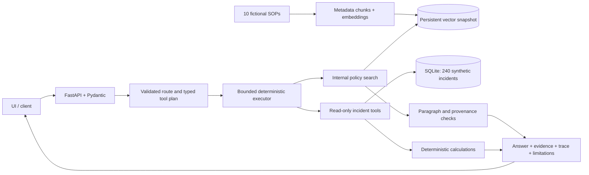

# OpsPilot V1 architecture

OpsPilot is a CPU-only modular monolith: one FastAPI process, a static UI, SQLite
incident history and an immutable local vector snapshot. Provider adapters keep
model-specific HTTP separate from deterministic domain tools. The operational
incident domain and all business data are fictional/synthetic.

## Implemented modules

| Module | Responsibility |
|---|---|
| `opspilot/api/` | FastAPI request validation, readiness, public tool schemas, request IDs |
| `opspilot/domain/` | Pydantic incidents, filters, tool plans, evidence and response contracts |
| `opspilot/rag/` | Metadata-preserving Markdown/TXT ingestion and persistent vector retrieval |
| `opspilot/providers/` | TF-IDF baseline, optional dense embeddings, configurable JSON chat HTTP |
| `opspilot/data/` | Constrained SQLite schema, reproducible seed and read-only repositories |
| `opspilot/tools/` | Four allow-listed typed read-only capabilities |
| `opspilot/orchestration/` | Routing, validated dispatch, evidence selection and grounded synthesis |
| `opspilot/evaluation/` | Versioned 50-case datasets, deterministic graders and guarded live runner |
| `opspilot/ui/` | Lightweight UI displaying sources, evidence status, trace and synthetic disclosure |

## Evidence authority

Internal policy/SOP text establishes fictional company procedure. SQLite establishes
historical facts in the synthetic snapshot. Interpretation is labelled separately.
Neither external web information nor model prior knowledge may fill a missing
internal-policy requirement. No external-search fallback is implemented.

Policies retain document ID, title, section/chunk ID, version, effective date,
policy type, status and owner. Ingestion creates 60 stable section chunks. Policies
not effective at the reference time are excluded. An operator CLI rebuilds stores;
there is no public upload, ingestion or admin endpoint.

The default index uses lexical TF-IDF embeddings and cosine retrieval in a persistent
JSON snapshot. It requires no neural model download or cloud vector service.
The small corpus makes this reproducible and inexpensive, while unseen paraphrases
remain a limitation. The optional dense adapter has transport/dimension tests;
its live retrieval quality is not claimed.

## Routes and tools

Routes are `policy_only`, `data_only`, `mixed` and `unsupported`.
Offline mode uses bounded English intent/filter rules. Live `chat_api` uses a JSON
planner followed, when needed, by a complete-paragraph evidence selector.
Both modes execute the same deterministic tools:

- `search_internal_policy`
- `get_incident`
- `find_similar_incidents`
- `calculate_incident_metrics`

Pydantic validates each proposed call. Tool names and arguments are allow-listed;
there is no arbitrary SQL, shell, filesystem, network-execution or write tool.
A tool may appear once in a plan. Tool counts, top-K, timeouts and HTTP retries are
bounded. Safety guards refuse prohibited requests before inference or tool execution.

The planner receives a bounded read-only catalog of exact service/category names.
Scenario severity/impact does not silently narrow the historical cohort. Inferred
topic words do not justify a policy metadata filter. For named incidents, the policy
selector receives validated severity/category facts without free-text root-cause
or resolution fields; these facts help choose an applicable conditional paragraph.

A deterministic executor guard omits an unrequested similarity sample when a plan
also requests whole-cohort metrics. Explicit sample requests remain intact and
omissions appear in limitations. This adds no model retry, new tool or graph.

## Grounded response contract

Responses include `answer`, `route`, `confidence`, `evidence_sufficiency`, `evidence`,
labelled facts, `tool_trace`, usage and limitations. Confidence is an evidence label,
not a calibrated probability. Traces expose validated actions/results, never private
chain-of-thought.

Policy statements are complete verbatim paragraphs. Deterministic checks validate
text equality, chunk provenance and citations. This reduces invented procedures but
trades fluency for integrity. Equality does not establish semantic relevance or
completeness. Missing policy evidence yields `insufficient_evidence`; a partial mixed
answer may retain supported data facts. Incident arithmetic runs in code.

## Incident semantics and controls

The model-facing repository opens SQLite with URI `mode=ro`, `query_only=ON`, fixed
query shapes and bound filter values. Seed 42 creates 240 incidents across six
categories and five functions, including outliers and twelve unresolved records.
Timestamp, status, severity, downtime and customer-impact constraints are validated.

UTC time windows include `since` and exclude `until`. Relative windows use the fixed
2026-10-01 reference. Downtime metrics use resolved records with known durations,
report excluded records and use nearest-rank p90. Customer-impact sums represent
exposures, not unique people. Current policy does not prove historical compliance.
See [enterprise context](FICTIONAL_ENTERPRISE.md).

## Deployment and observability

One non-root container and persistent volume support the SQLite/index stores.
The Compose app has a read-only root, dropped capabilities and loopback port binding.
Cheap liveness/readiness checks never call an LLM. JSON logs record request IDs,
routes, source IDs, tool outcomes and latency without raw questions, results or keys.
See [deployment](DEPLOYMENT.md).

## Design decisions and measured limits

| Decision | Reason and accepted trade-off |
|---|---|
| Modular monolith | Simple deployment and inspectable boundaries; no distributed infrastructure |
| SQLite | Validated portable incident evidence; not an enterprise-scale throughput benchmark |
| TF-IDF snapshot | CPU-only deterministic retrieval; limited unseen semantic matching |
| JSON planner + deterministic tools | Flexible selection with schema/permission boundaries; model mistakes remain possible |
| Quote-first policy response | Strong paragraph provenance; verbose and less fluent than free-form synthesis |
| Deterministic graders | Reproducible route, numeric and provenance checks; no general semantic-quality guarantee |

The upstream reference informed architecture only. Cloud-index reset, automatic web
fallback and graph coupling were excluded from the original implementation.
[Reference notices](../THIRD_PARTY_NOTICES.md) preserve the inspected source/commit
and license status. No upstream application/UI/data source was copied.

The tuned offline regression passes 50/50. The complete recorded real-provider
regression passes 50/50 after measured planning/executor fixes; earlier failures
remain available. See [evaluation](EVALUATION.md),
[live validation](LIVE_LLM_VALIDATION.md) and [acceptance](FINAL_ACCEPTANCE.md).
Held-out semantic quality, concurrent VPS performance, production authentication
and multi-tenancy remain unverified or outside this implementation.
